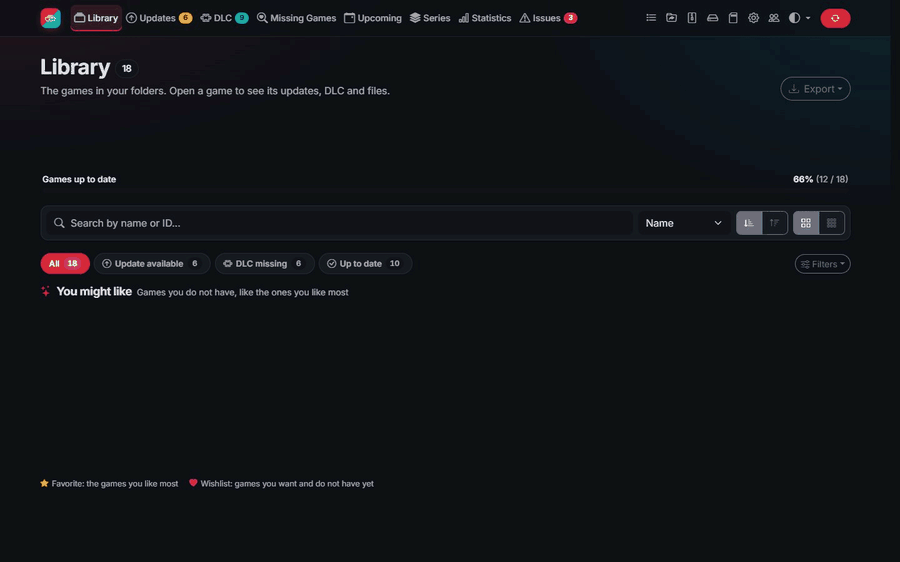
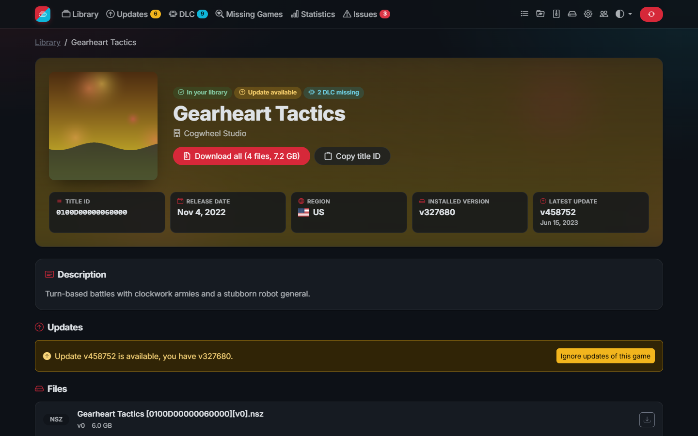
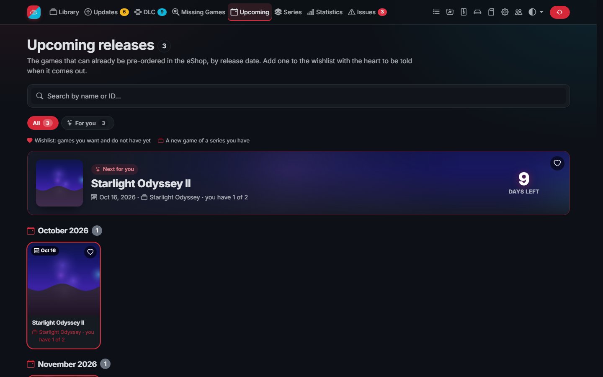
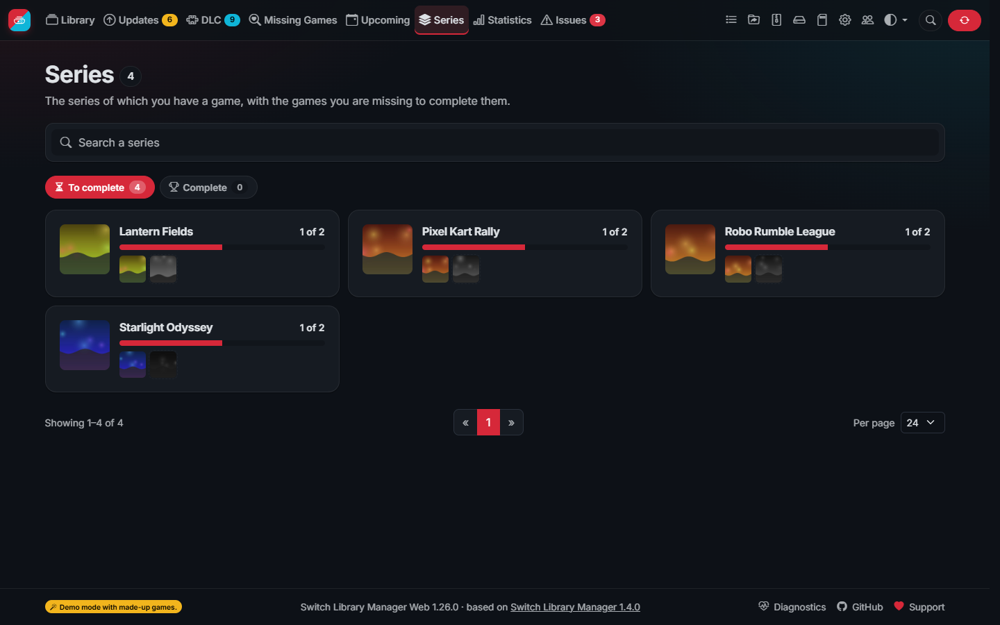
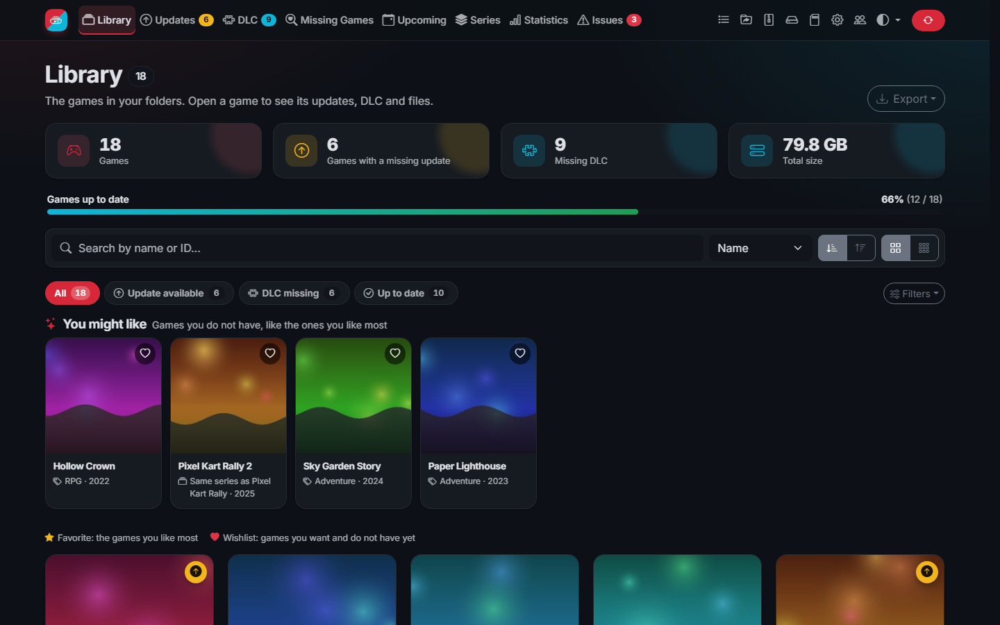
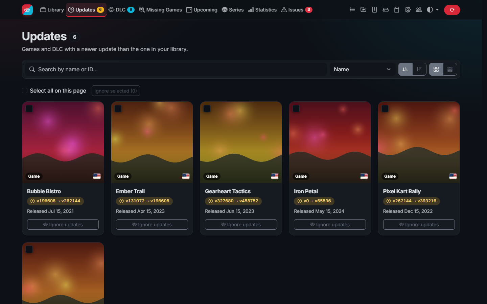
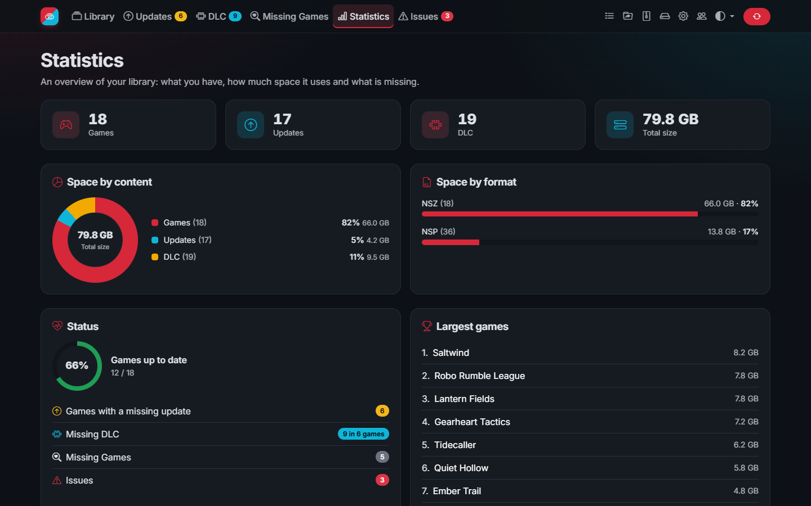
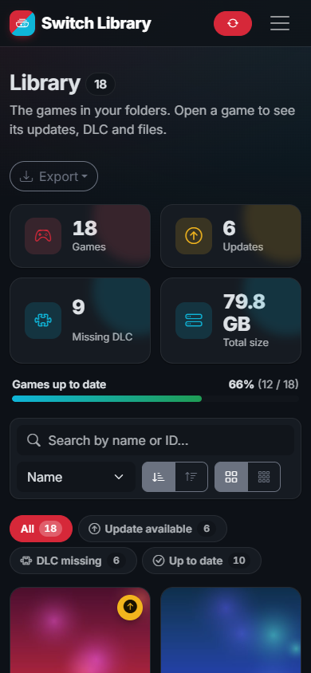

# Switch Library Manager Web

[](https://github.com/DeLFuS77/switch-library-manager-web/releases)
[](https://hub.docker.com/r/delfus77/switch-library-manager-web)
[](https://github.com/DeLFuS77/switch-library-manager-web/actions/workflows/test.yml)
[](https://github.com/DeLFuS77/switch-library-manager-web/blob/master/LICENSE)

Manage the backups of your Nintendo Switch games from the browser: see which updates, DLC and games you are missing,
find broken or duplicate files, keep your folders tidy and save space with NSZ compression. It runs on Windows, macOS,
Linux, Docker, NAS and Raspberry Pi.

> Built on the work of [@giwty](https://github.com/giwty), who created
> [Switch Library Manager](https://github.com/giwty/switch-library-manager), [@dtrunk90](https://github.com/dtrunk90),
> who made [its web version](https://github.com/dtrunk90/switch-library-manager-web), and
> [@trembon](https://github.com/trembon), whose [fixes](https://github.com/trembon/switch-library-manager) are included.
> Thank you! See [Thanks](#thanks) and [NOTICE](NOTICE.md).

> [!IMPORTANT]
> This project contains **no keys, no games and no copyrighted content**, and it never downloads them. Use it only
> with backups of games you own. The few features that read the content of your files use **your own** `prod.keys`,
> which you dump from **your own console** (for example with Lockpick_RCM) and keep on your computer: keys are never
> included, uploaded or shared. Never post your keys anywhere, also not in issues, logs or screenshots.

<p align="center">
  
</p>

<p align="center">
  
  
  
</p>

<p align="center">
  
  
  
</p>

<p align="center">
  
</p>

<sub>The tour and the screenshots show the demo mode: the games, publishers and covers are made up.</sub>

## Contents

- [Features](#features)
- [Quick start](#quick-start): [Docker](#docker), [Synology and Portainer](#synology-and-portainer), [Unraid](#unraid), [Windows, macOS and Linux](#windows-macos-and-linux)
- [Your keys](#your-keys)
- [First start](#first-start)
- [Guides](#guides): [Organize](#organize), [Compress](#compress), [Users](#users-and-password-protection),
  [Notifications](#notifications), [API](#api), [Settings](#settings)
- [Updating](#updating)
- [Demo mode](#demo-mode)
- [Troubleshooting](#troubleshooting)
- [Building](#building)
- [License](#license)

## Features

**Your library at a glance**
- Scans your folders (NSP, NSZ, XCI, XCZ and split files) and rescans by itself when files change
- An overview of your games, missing updates and DLC, and the space they use
- Missing updates (for games and DLC), missing DLC and missing games, with filters and search
- Library filters by status, genre, players, language, format, region, collection, games or demos, and games
  without a cover; sort by size or date added; a search that forgives typos
- SD card planner: the games that fit on a card by what you like, copied to the card in one go
- Favorites, your own collections of games ("Playing", "For the kids"...) and actions on several games at once
- The missing games greyed out with yours on request, and the games of the same series on each game page
- A wishlist of games you do not have yet, with a notification when they come out
- Game pages with description, screenshots, versions, DLC and downloads (a whole game as one ZIP)
- Statistics with charts and the history of your library, and an export as CSV, JSON or a web page to share

**Keep it tidy**
- Issues: unsupported, duplicate, old, damaged or unidentified files
- Organize files in folders and rename them from templates, always with a preview first
- Delete old updates, duplicates and empty folders
- Ignore lists for DLC, updates and file types; hide demos

**Save space**
- Compress NSP to NSZ and XCI to XCZ (10 to 60% smaller), installed directly by Tinfoil, DBI and other installers;
  convert XCI to NSP
- Every file is verified before the original is deleted; NSZ files can be decompressed back to NSP
- Space page: see how much old updates, duplicates and already compressed originals take, and free it safely

**Built to run on a server**
- Docker image for amd64 and arm64, Unraid template, low memory use and fast with tens of thousands of files:
  the library shows up while it is scanned, covers and thumbnails load in the background
- Background hours: keep cover downloads, thumbnails and compression for the night
- User accounts with administrator and read-only roles, a language per user and an activity log
- Live tasks page, scheduled synchronization and notifications (Discord, Telegram, webhook) of new updates, DLC
  and games
- JSON API with OpenAPI description, e.g. for Home Assistant
- Interface in English, Spanish, French, German, Italian, Portuguese, Dutch, Russian, Japanese, Korean and Chinese
  (including game names where the eShop has them), light and dark theme

## Quick start

### Docker

The image is on [Docker Hub](https://hub.docker.com/r/delfus77/switch-library-manager-web) as
`delfus77/switch-library-manager-web` (also `ghcr.io/delfus77/switch-library-manager-web`), for amd64 and arm64.

With Docker Compose, download [docker-compose.yml](https://github.com/DeLFuS77/switch-library-manager-web/blob/master/docker-compose.yml), set the folder of your games and run
`docker compose up -d`. Or with `docker run`:

```
docker run -d \
  --name switch-library-manager-web \
  --restart unless-stopped \
  -p 3000:3000 \
  -e PUID=1000 -e PGID=1000 -e TZ=Europe/Madrid \
  -v /path/to/appdata:/usr/local/share/switch-library-manager-web \
  -v /path/to/your/switch/games:/mnt/roms \
  delfus77/switch-library-manager-web
```

Then open http://localhost:3000 (or the address of your server).

| Setting | Meaning |
|---|---|
| `-p 3000:3000` | The port of the web interface |
| `/usr/local/share/switch-library-manager-web` | Data folder: settings, caches, covers and **your keys** |
| `/mnt/roms` | Your games; writable, to organize and compress files |
| `PUID`, `PGID` | The user and group that own your games (`id` on the host). The app never runs as root |
| `TZ` | Your time zone, for dates and scheduled synchronizations |

To update, pull the new image and recreate the container: `docker compose pull && docker compose up -d`.

### Synology and Portainer

Ready-made files and step-by-step instructions are in [Installing on a NAS](docs/install/nas.md):

| System | How |
|---|---|
| Synology (DSM 7.2+) | Container Manager project: [templates/synology/docker-compose.yml](templates/synology/docker-compose.yml) |
| Portainer | App template URL: `https://raw.githubusercontent.com/DeLFuS77/switch-library-manager-web/master/templates/portainer.json` |

### Unraid

Search for **Switch Library Manager** in the **Apps** tab and install it. The port, folders and user (`99:100`) are
filled in, and can be changed when installing or later with **Edit**. Set **Switch library** to the share with your
games, for example `/mnt/user/switch`, and copy your keys to `/mnt/user/appdata/switch-library-manager-web/`.

The template can also be installed by hand: in a terminal on the server run

```
wget -O /boot/config/plugins/dockerMan/templates-user/my-switch-library-manager-web.xml https://raw.githubusercontent.com/DeLFuS77/switch-library-manager-web/master/templates/switch-library-manager-web.xml
```

then choose **Docker > Add Container** and pick `switch-library-manager-web` in **Template**. Do not install the
image from the Docker Hub search: the port and folders would be empty.

### Windows, macOS and Linux

Download the file for your system from the [latest release](https://github.com/DeLFuS77/switch-library-manager-web/releases/latest),
unpack it and run the program; nothing has to be installed.

| System | File |
|---|---|
| Windows (most PCs) | `…-windows-x64.zip` |
| Windows on ARM | `…-windows-arm64.zip` |
| macOS with Apple chip (M1 or newer) | `…-macos-apple.tar.gz` |
| macOS with Intel chip | `…-macos-intel.tar.gz` |
| Linux, PC | `…-linux-x64.tar.gz` |
| Raspberry Pi 4/5 with a 64-bit system, other ARM 64-bit | `…-linux-arm64.tar.gz` |
| Raspberry Pi with a 32-bit system | `…-linux-armv7.tar.gz` |

- **Windows**: double-click `switch-library-manager-web.exe`; the app opens in the browser. The first time, Windows
  may show "Windows protected your PC" because the program is not signed: click **More info → Run anyway**.
- **macOS**: double-click `switch-library-manager-web`, or run it from the Terminal. The program is not signed by Apple,
  so the first time macOS refuses to open it: right-click it, choose **Open** and confirm, or run
  `xattr -d com.apple.quarantine switch-library-manager-web` in its folder.
- **Linux and Raspberry Pi**: run `./switch-library-manager-web` and open http://localhost:3000 (or the address of the
  computer from another device).

The program keeps its settings and data next to itself, or in the folder set in the `SLM_DATA_DIR` environment
variable. Set your folders in **Settings**. To update, replace the program with the one of the new version: the data
stays. `SLM_OPEN_BROWSER=false` stops it from opening the browser, `true` makes it open it on Linux too.

## Your keys

Keys are optional. Without them the app still works: games are recognized by their file name, for example
`Super Mario Odyssey [0100000000010000][v0].nsp`. With your keys it reads the files themselves, so games are found even
when the names are wrong, and you can compress and decompress them.

| File | Needed for |
|---|---|
| `prod.keys` | Reading your files and compressing them. Dump it from your own console |
| `title.keys` | Only to compress games whose NSP has no ticket. Dumped together with `prod.keys` |

Put them in the data folder (with Docker, the folder mounted on `/usr/local/share/switch-library-manager-web`), or set
another folder in **Settings**. You can also mount `prod.keys` read-only:
`-v /path/to/prod.keys:/usr/local/share/switch-library-manager-web/prod.keys:ro`.

The app looks for `prod.keys` in this order: the path in **Settings**, the data folder, then `~/.switch/prod.keys`.
`title.keys` is read from the same folder as `prod.keys`.

Games made for a newer firmware need keys dumped from a console with that firmware: the Issues page tells you when a
key is missing.

## First start

1. On the first start the titles database is downloaded (names, covers, updates and DLC of every game).
2. The Library page shows a checklist: the titles database, your keys, your folders and the first scan. Every step
   links to where it is done.
3. Your games appear once the folders are scanned. New, removed or replaced files are picked up by themselves.

## Guides

### Organize

The Organize page moves and renames files according to its options. Every action shows the exact list of changes
first, and nothing happens until you apply them. Existing files are never overwritten, files that changed since the
last scan are not deleted, and split files are left untouched.

Templates for folder and file names can use:

| Placeholder | Value |
|---|---|
| `{TITLE_NAME}` | Game name |
| `{TITLE_ID}` | Title ID |
| `{VERSION}` | Version number of the file, like `65536` |
| `{VERSION_TXT}` | Version as shown on the console, like `1.0.1` |
| `{REGION}` | Region |
| `{TYPE}` | `BASE`, `UPD` or `DLC` |
| `{DLC_NAME}` | DLC name |

Templates must contain `{TITLE_NAME}` or `{TITLE_ID}`.

### Compress

The Compress page turns NSP files into NSZ files and XCI files into XCZ files. They take 10 to 60% less space and are
installed directly by Tinfoil, DBI and other installers. It uses your `prod.keys` (and `title.keys` for games without a
ticket).

Every file is handled safely:

1. The files inside the NSP are checked against their content IDs, so damaged or modified files are not compressed.
2. The NSZ is written next to the NSP under a hidden temporary name.
3. The NSZ is decompressed again and every part must give back the original SHA-256.
4. Only then is the NSZ renamed and, if you choose so, the NSP deleted.

Compression runs in the background as a task, can be cancelled and uses at most half of the processors. Update
patches are compressed too. Like nsz, an XCZ keeps only the secure partition, the one installers use.

NSZ files can be decompressed back to NSP on the same page, for tools that do not read NSZ. The NSP is the original
byte for byte. The format is the one of [nsz](https://github.com/nicoboss/nsz), written in Go for this project:
nothing else needs to be installed.

### Users and password protection

Without users, anyone on your local network who can open the app has full access, and every page shows a reminder.
Requests from outside the local network (the internet, also through a reverse proxy) are refused until an
administrator exists, so an app published by mistake is not open to everyone. Open **Users** and create an
administrator to require a login; you are logged in as that administrator right away. Then add more users with one of two roles:

| Role | Can |
|---|---|
| Administrator | Everything: synchronize, organize, compress, ignore items, change settings and manage users |
| Read only | Browse the library and download files; the controls that change something are hidden |

- Passwords are stored as bcrypt hashes in `users.json` in the data folder. Every user can change their own password
  in **My account**; a new password ends the other sessions of that user.
- Logins last 30 days; **Log out** ends the session for good, also on a copied cookie. After 10 failed logins an
  address is blocked for 15 minutes (behind a reverse proxy, the address of the client that the proxy reports).
- An administrator can also be set with the environment variables `SLM_AUTH_USERNAME` and `SLM_AUTH_PASSWORD`, which
  is useful when a password was forgotten.

- If another service already protects the app (a reverse proxy with its own login, a VPN) and you want no users, set
  `SLM_ALLOW_REMOTE_WITHOUT_LOGIN=true` so it also answers outside the local network.

Use HTTPS (for example behind a reverse proxy) when the app can be reached from outside your network: the app then
marks its cookies as secure and tells the browser to keep using HTTPS.

Other protections: other web sites cannot send actions to the app (CSRF), pages cannot be shown inside other sites,
only the app's own scripts run, request sizes and slow connections are limited, covers are only downloaded from the
internet (never from addresses of your network) and the settings, users and session files are readable only by the
app.

### Notifications

After every synchronization the app can tell you about new updates and DLC of your games, through a Discord webhook,
a Telegram bot or any webhook that accepts JSON (ntfy, Home Assistant, n8n...). Set them in **Settings >
Notifications**; only new items are reported.

### API

The JSON API lists the library and its statistics and downloads files. It is described in
[OpenAPI](https://github.com/DeLFuS77/switch-library-manager-web/blob/master/resources/static/openapi.json) format, also served by the app at `/api/openapi.json`.

| Endpoint | Description |
|---|---|
| `GET /api/titles` | Games in the library with their updates and DLC |
| `GET /api/statistics` | The numbers of the Statistics page |
| `GET /api/titles/{titleId}/archive.zip` | All files of a game as one ZIP |
| `GET /export/library.csv`, `/export/library.json` | Library export |
| `GET /sync`, `POST /sync` | Synchronization status, start a synchronization |
| `GET /api/tasks`, `GET /api/tasks/events` | Running and recent tasks, and their live updates |
| `GET /healthz` | Health check, without login |

When a login is required, API clients use HTTP basic authentication (a read-only user is enough to read). Example
Home Assistant sensor:

```yaml
rest:
  - resource: http://192.168.1.10:3000/api/statistics
    # username: viewer
    # password: !secret switch_library_password
    scan_interval: 3600
    sensor:
      - name: Switch games
        value_template: "{{ value_json.games }}"
      - name: Switch games with a missing update
        value_template: "{{ value_json.gamesWithUpdate }}"
      - name: Switch missing DLC
        value_template: "{{ value_json.missingDlc }}"
```

### Settings

Most settings are in the web interface. `settings.json` in the data folder also has:

| Setting | Description |
|---|---|
| `port` | Port of the web interface, `3000` by default |
| `debug` | Detailed log, useful when reporting a problem |
| `scan_workers` | Files read at the same time when scanning. `0` (default) uses up to 4; more for fast network storage, `1` for one slow disk |
| `titles_json_url` | Titles database. Default: the `data` release of this repository |
| `versions_json_url` | Versions database. Default: [blawar/titledb](https://github.com/blawar/titledb) |
| `localized_titles_json_url` | Translated game names and descriptions; `%s` is the language |

The titles database is built every 6 hours from [blawar/titledb](https://github.com/blawar/titledb) by the
[Update title data](https://github.com/DeLFuS77/switch-library-manager-web/blob/master/.github/workflows/update-title-data.yml) workflow and published in the `data` release. If it
cannot be downloaded, a mirror is used.

Every week the app keeps a copy of its configuration (settings, users, favorites, collections, wishlist and history)
in the `backups` folder of the data folder, the last 5. **Settings > Backup** lists them to download or restore, and
makes one at any moment.

## Updating

- **Unraid, installed from the Apps tab:** Docker tab > Check for Updates > update.
- **Created with `docker run`** (on Unraid also when the template could not be saved, which shows "Configuration not
  found" when updating): download the new image and create the container again with the same folders. Your settings,
  keys, covers and caches stay, because they are in the data folder. The app shows these commands with your folders
  already filled in under **How to update** (from the update notice or Settings).

```bash
docker pull delfus77/switch-library-manager-web:latest && docker stop switch-library-manager-web && docker rm switch-library-manager-web
```

  Then run your `docker run` command again.
- **Windows, macOS, Linux:** stop the app, replace the file with the new version and start it.

## Demo mode

To look around without any games, start the app with the environment variable `SLM_DEMO=true`. It shows a made-up
library (invented titles and generated covers), does not read your folders or download anything, and refuses every
change:

```bash
docker run --rm -p 3000:3000 -e SLM_DEMO=true delfus77/switch-library-manager-web
```

## Troubleshooting

**Diagnostics** (in the footer and in Settings) checks at a glance the keys, the library folders, the titles database,
the free space, the automatic copies and the protection, and tells what to do about what is wrong. **Copy the report**
to ask for help: it holds no key and no password.

**The web interface does not open.** Check that the port is published (`-p 3000:3000`, or the WebUI port on Unraid) and
open `http://<address of the server>:3000`. `docker logs switch-library-manager-web` shows why the app stopped, if it
did.

**"The data folder is not writable".** Set `PUID` and `PGID` to the owner of the folders on the host (on Unraid
`99` and `100`).

**Keys not found.** Put `prod.keys` in the data folder, or set its folder in **Settings**, and save the settings. The
first step of the checklist and the Settings page tell you whether the keys were found.

**A game is missing or shown as an issue.** Open **Issues**: it explains every file that could not be added, for
example a key missing from an old `prod.keys` or a damaged file.

**No covers.** Covers are downloaded from the Nintendo servers during the scan. If your network blocks them, the
placeholder is shown and the next scan tries again.

**Reporting a problem.** Use the [issue tracker](https://github.com/DeLFuS77/switch-library-manager-web/issues). Set
`debug` to `true` in `settings.json` and attach the log, but **never your keys**.

## Building

Requirements: [Go](https://go.dev) 1.25+ and [Node.js](https://nodejs.org) (for the web interface).

```
git clone https://github.com/DeLFuS77/switch-library-manager-web.git
cd switch-library-manager-web
npm ci
npm run build       # web interface (sass + esbuild)
make build          # Linux
make build-windows  # Windows
make build-mac      # macOS (Apple Silicon)
make test
```

The programs are written to `build`. The web interface is embedded in the program, so `npm ci` and
`npm run build` must run first. Without `make` (e.g. on Windows): `go build -o build/switch-library-manager-web.exe .`

`.github/scripts/build_release.sh <version>` builds and packs the programs of every system in `dist`, as the releases do.

## License

The changes made in this repository are published under the [MIT license](https://github.com/DeLFuS77/switch-library-manager-web/blob/master/LICENSE). The projects this fork is based
on did not publish a license, so their code remains under the copyright of their authors; see [NOTICE](https://github.com/DeLFuS77/switch-library-manager-web/blob/master/NOTICE.md).

### Thanks

- Based on [giwty's switch-library-manager](https://github.com/giwty/switch-library-manager) and
  [dtrunk90's switch-library-manager-web](https://github.com/dtrunk90/switch-library-manager-web)
- Parsing, organizing and title data fixes from [trembon's switch-library-manager](https://github.com/trembon/switch-library-manager)
- Title data from [blawar's titledb](https://github.com/blawar/titledb)
- NSZ format of [nsz](https://github.com/nicoboss/nsz) and the [Inter](https://github.com/rsms/inter) font
- Everyone who reports bugs, like [@LonelyTV](https://github.com/LonelyTV) ([#3](https://github.com/DeLFuS77/switch-library-manager-web/issues/3))
